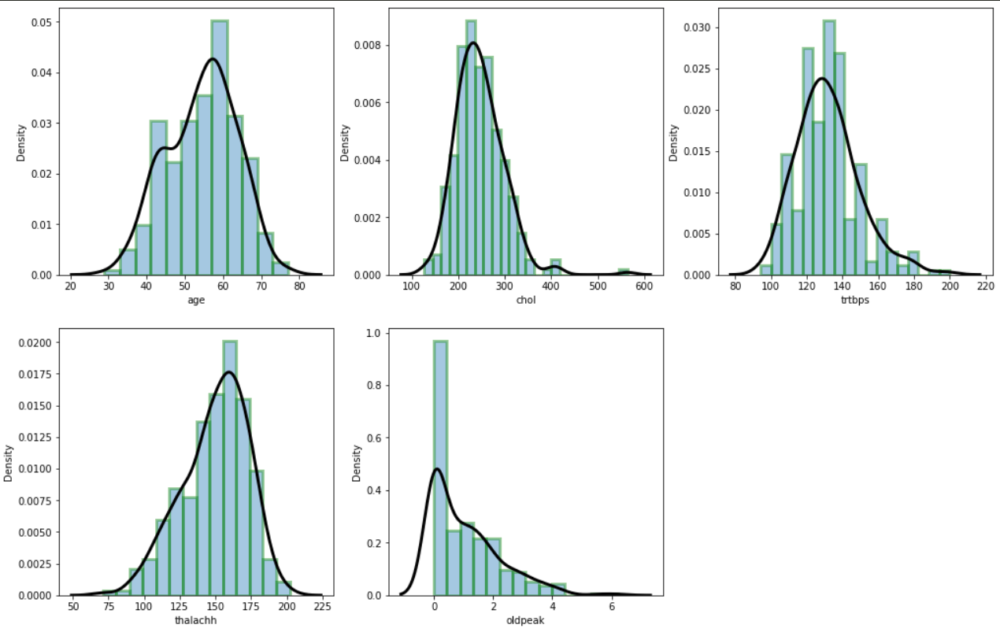
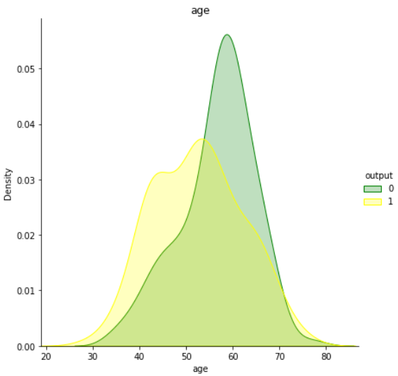
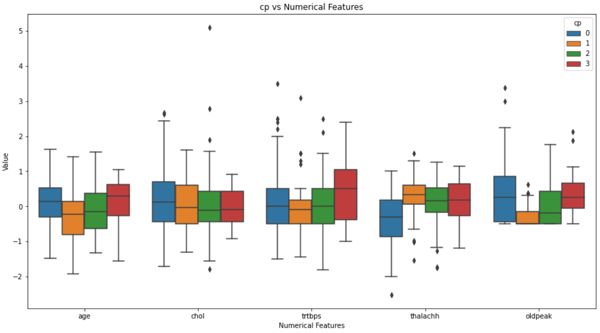
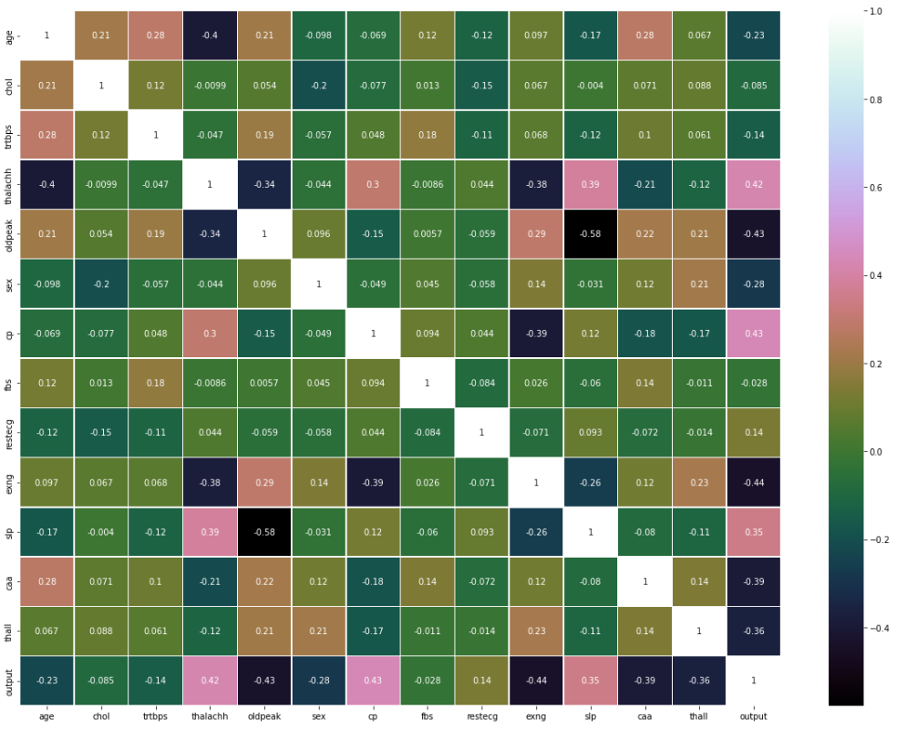
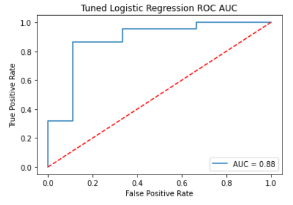
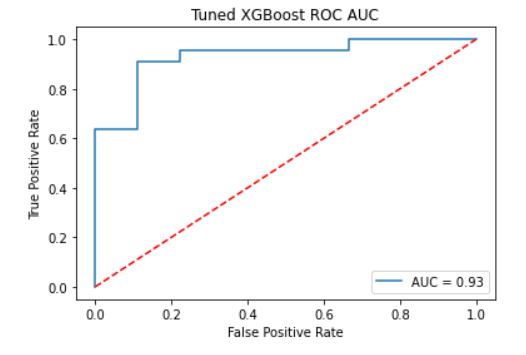
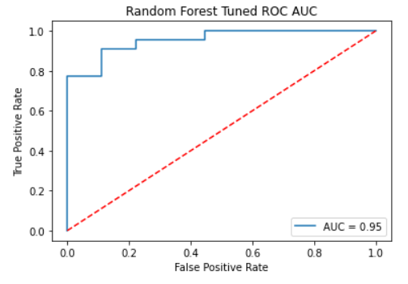

HEART ATTACK CLASSIFICATION

DATASET OBTAINED FROM KAGGLE

DATA ANALYSIS + DATA VISUALIZATION + MODEL BUILDING

USE OF LOGISTIC REGRESSION, XGBOOST, RANDOM FOREST 

USE OF HYPERPARAMETER TUNING USING GRIDSEARCH CV 

USE OF ROC-AUC METRIC

